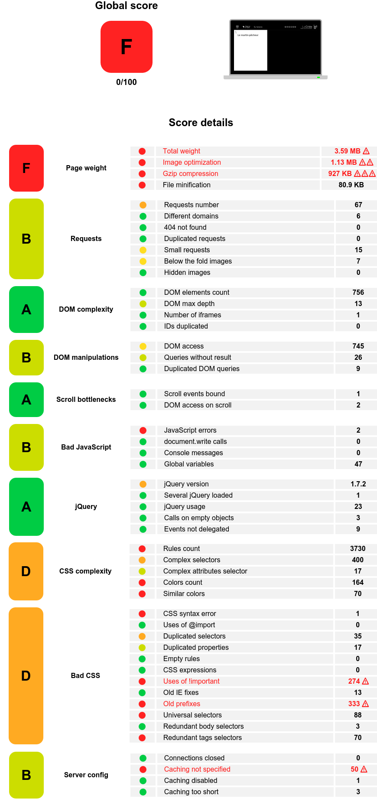
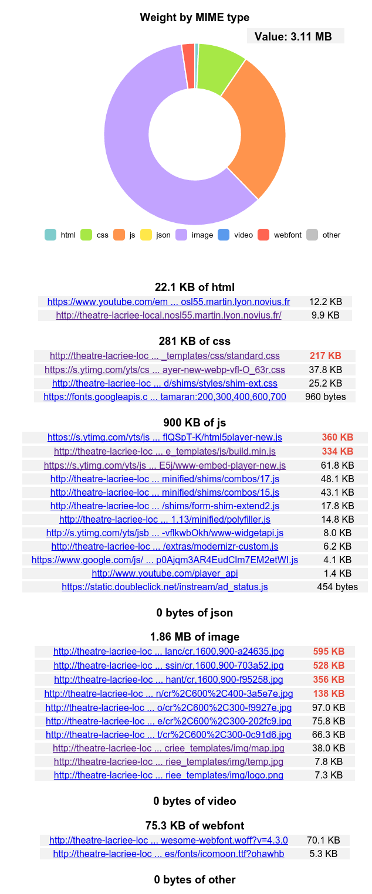
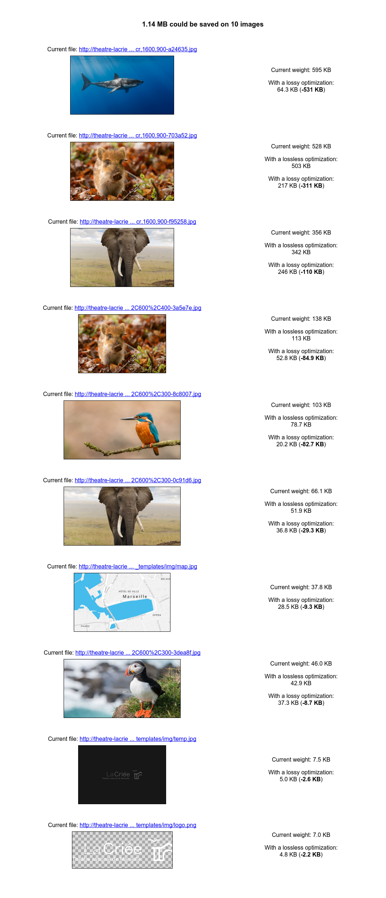
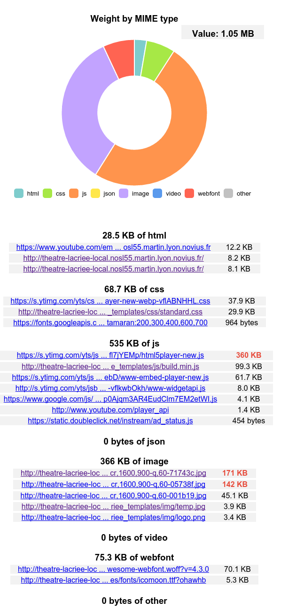
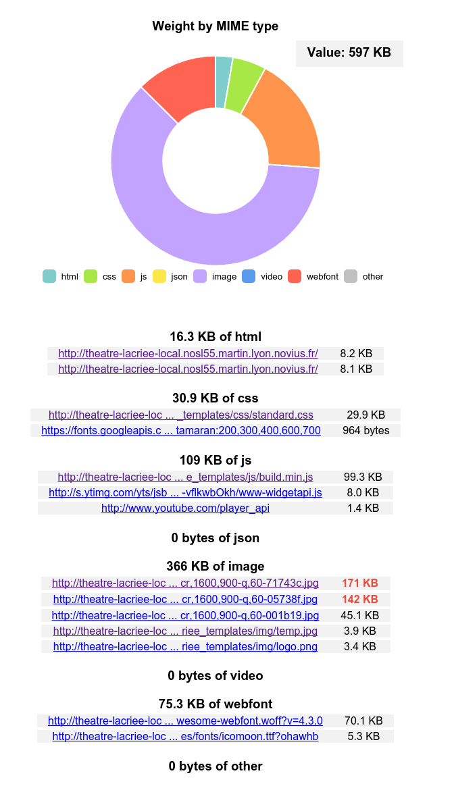

# Optimizing a website with Yellow Lab Tools

_In this post I will discuss how I've drastically improved performances on a website using Yellow Lab Tools_

## What's YLT ?

I've recently discovered a website analytic tool called [Yellow Lab Tools](https://github.com/gmetais/YellowLabTools/).

Basically it's a node app that uses [PhantomJS](http://phantomjs.org/) as a browser and collect data with
[Phantomas](https://github.com/macbre/phantomas).

It's incredibly powerful, fast and you can install it locally and that kick ass.

The level of detail is amazing and while there are some tweaking and the app is not perfect it's incredibly strong.

## General considerations

The website I made my experiments onto was for a client of the web agency i work for, Novius.

It's the website of the national theater of Marseille, [La Criée](https://fr.wikipedia.org/wiki/La_Cri%C3%A9e).

This website was developed with [Novius OS](http://www.novius-os.org/) an open-source in-house PHP CMS.

I did it with some time constraint, I took three hours only to optimize the best I could and see the results.

## How are we doing ?

I started my tests on the homepage, the heaviest page of the website (and of most website). Once I have decided that
this one was good enough, I would test others as well.

Short answer : __bad__, really bad...

Seeing this I realized that even with some optimizations that I made
(pre/post processing of style and js, image caching, ...) the website was style ridiculously heavy and slow.

The score of 0/100 is a slap in the face, but a good one, now we need to investigate to see what we can do to improve
this score.

## Analyzing the results

There is a lot of informations in this report and it's not really clear what has a real importance on the score, so
i decided to not care about the score, but to try to remove as much red dots as possible.]

### Page weight
First we have the page weight. Having any red dot here is unacceptable to me, it will weight on every visitor,
particularly on mobile, we really need to improve that.

### Requests
Then we have requests, there seems to have way to many requests, even if the scores are good-ish, it's one of the
biggest frustration for mobile users and it's a sign of a faultly conception, if we have ~70 requests on one page
there is a problem that could easily snowball if it's not adressed.

### DOM Manipulation
There is some bad score (even more in production) in the DOM manipulations section. While investigating i detected that
it mostly came from a slideshow plugin or the off-canvas menu. Unfortunately there is little room for improvement here
without changing/rewriting plugins and it didn't fit in my time frame.

### Bad javascript
There is an apparent Javascript error in the Bad Javascript section. I could reproduce it and it doesn't appear in
pre-production so I guess it's an error thrown by YLT on local webservers.

### jQuery
For some reason we had a really outdated version of jQuery (from march 2012 !). I just updated it. I think this error
could be rated higher than that because it's really simple to upgrade jQuery and there is little to none compatibility
issues.

### CSS

Now we hit some big part. Our CSS sucks. Over 3700 rules, 150+ colours defined, old prefixes, importants everwhere.
This need optimizing, and a lot.

## Attacking the page weight

Being on a development environment, gzip was not enabled for some reason. For the same reason, my javascript files were
not concatenated nor compressed on development, i did some tweak to change this behaviour for YLT and i got rid of two
of my red dots.

Now we need to look at the total weight, we go in the details and see this.

It was half expected but yeah that's a big lot of requests.

Most of them came either from Youtube or strangely from an app we have developed in the CMS that displays form.

### Cleaning js dependancies

To reduce youtube's payload I decided to remove temporarly the youtube video embeded in the homepage. And I had the bad
surprise to find that the youtube API was loaded on every page even if there was no video at all. It's a small improvement
but here goes 4-5 requests gone on every pages. (The api loads some CSS and require some JS).

The form app had some issues as well, even if i had put the app's js in my bundled js, this one would autoload some polyfill
adding even more requests, and on every page as well. Some minor modifications made me add the polyfill package into
my bundled js and only load some polyfill when really needed.

### Optimizing images

Next we see that most images are huge and take more than half of the page size. So I go to the image optimization details
and see this.

God that's a load of unoptimized image. And there was numerous other examples in the website.

I opted for two major changes:
* Crop image when needed when they were scaled down by the browser.
* Drop jpeg quality to 75% and even 60% for the big 1600x900 full screen images.

Here you can see the differences between the 100% quality image and the 60% one.

Can you spot a difference ? Me neither, but one is nearly 600kb and the other one is 140kb, that's a huge difference.

That's a load of file size reduced and now the only biggest files we have are youtube's javascripts.

It gets even better without youtube dropping from __3.59Mb__ to __597kb__. That's a big ass improvement !

Now with two little changes we lowered 7 time the page weight making it acceptable on mobile.

## Room for improvement ?

